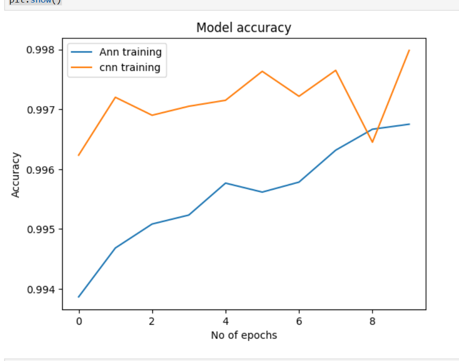
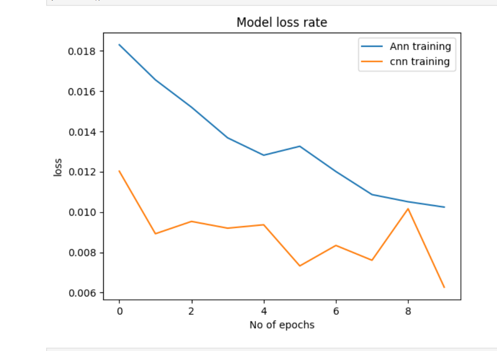

# Handwritten Digit Classification using ANN and CNN

This project implements **Handwritten Digit Recognition** using the **MNIST dataset** and compares the performance of two neural network architectures:

- Artificial Neural Network (ANN)
- Convolutional Neural Network (CNN)

The goal is to demonstrate how **CNN performs better than ANN for image classification tasks** by comparing their **training accuracy and loss**.

---

## Dataset

The dataset used is the **MNIST handwritten digit dataset**, which contains grayscale images of handwritten digits.

Dataset details:

- Total images: **70,000**
- Training images: **60,000**
- Testing images: **10,000**
- Image size: **28 × 28 pixels**
- Classes: **Digits from 0 to 9**

The dataset is loaded using TensorFlow/Keras.

---

## Models Implemented

### 1. Artificial Neural Network (ANN)

The ANN model uses fully connected dense layers.

Architecture:

- Input Layer (784 neurons – flattened image)
- Dense Layer
- Dense Layer
- Output Layer (10 neurons with Softmax activation)

ANN treats the image as a **vector of pixel values** and does not capture spatial relationships between pixels.

---

### 2. Convolutional Neural Network (CNN)

The CNN model uses convolutional layers to extract spatial features from images.

Architecture:

- Convolution Layer
- Max Pooling Layer
- Convolution Layer
- Flatten Layer
- Dense Layer
- Output Layer (Softmax activation)

CNN is more suitable for image recognition tasks because it can **learn spatial patterns such as edges and shapes**.

---

## Accuracy Comparison

The following graph shows the **training accuracy comparison between ANN and CNN**.



Observation:

- CNN achieves slightly **higher accuracy than ANN**
- CNN learns features more effectively from image data

---

## Loss Comparison

The following graph shows the **training loss comparison between ANN and CNN**.



Observation:

- CNN maintains **lower loss during training**
- ANN loss decreases but remains higher compared to CNN

---

## Results

| Model | Training Accuracy | Training Loss |
|------|------------------|--------------|
| ANN | High | Moderate |
| CNN | Very High | Low |

Conclusion:

CNN performs better than ANN for image classification because convolution layers **preserve spatial information in images**.

---

## Technologies Used

- Python
- TensorFlow
- Keras
- NumPy
- Matplotlib
- Jupyter Notebook

---

## How to Run the Project

Clone the repository:

```bash
git clone https://github.com/your-username/mnist-digit-classification.git
